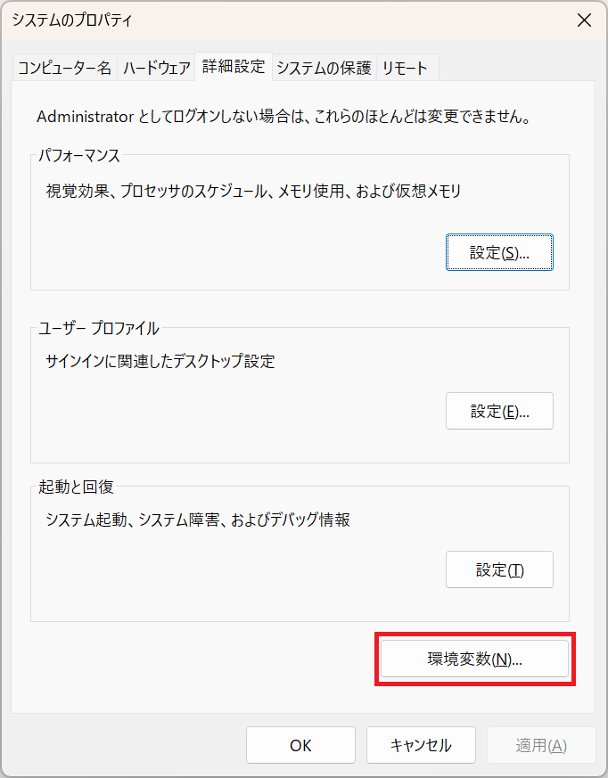

# Python 環境構築ガイド

Created on November 08, 2023  
Copyright (c) 2023 led-mirage  

## 目次

- [1. はじめに](#1-はじめに)
- [2. 対象読者](#2-対象読者)
- [3. 環境構築の流れ](#3-環境構築の流れ)
- [4. pyenv-win のインストール](#4-pyenv-win-のインストール)
  - [4-1. pyenv-win.zip のダウンロード](#4-1-pyenv-winzip-のダウンロード)
  - [4-2. .pyenv ディレクトリの作成](#4-2-pyenv-ディレクトリの作成)
  - [4-3. ZIPファイルの解凍](#4-3-zipファイルの解凍)
  - [4-4. 環境変数の設定](#4-4-環境変数の設定)
  - [4-5. 動作確認](#4-5-動作確認)
  - [4-6. pyenv-win のアンインストール](#4-6-pyenv-win-のアンインストール)
  - [4-7. pyenv-win の更新](#4-7-pyenv-win-の更新)
- [5. Python のインストール](#5-python-のインストール)
  - [5-1. インストール可能なバージョンの確認](#5-1-インストール可能なバージョンの確認)
  - [5-2. バージョンを指定してPythonをインストール](#5-2-バージョンを指定してpythonをインストール)
  - [5-3. インストールしたバージョンをカレントにする](#5-3-インストールしたバージョンをカレントにする)
  - [5-4. カレントバージョンの確認](#5-4-カレントバージョンの確認)
  - [5-5. 動作確認する](#5-5-動作確認する)
  - [5-6. インストール済みの Python バージョンの一覧を取得する](#5-6-インストール済みの-python-バージョンの一覧を取得する)
  - [5-7. アンインストール](#5-7-アンインストール)
- [6. ライブラリの管理](#6-ライブラリの管理)
  - [6-1. インストールされているライブラリの一覧](#6-1-インストールされているライブラリの一覧)
  - [6-2. ライブラリのインストール](#6-2-ライブラリのインストール)
  - [6-3. ライブラリのアンインストール](#6-3-ライブラリのアンインストール)
  - [6-4. pip の更新](#6-4-pip-の更新)
- [7. Python 仮想環境の構築](#7-python-仮想環境の構築)
  - [7-1. 仮想環境とは](#7-1-仮想環境とは)
  - [7-2. プロジェクトディレクトリの作成](#7-2-プロジェクトディレクトリの作成)
  - [7-3. 使用する Python のバージョンを決める](#7-3-使用する-python-のバージョンを決める)
  - [7-4. venv を使用して仮想環境を作成する](#7-4-venv-を使用して仮想環境を作成する)
  - [7-5. 仮想環境のアクティベーション](#7-5-仮想環境のアクティベーション)
  - [7-6. ライブラリの管理](#7-6-ライブラリの管理)
  - [7-7. 仮想環境のディアクティベーション](#7-7-仮想環境のディアクティベーション)
  - [7-8. Visual Studio Code での仮想環境の使用](#7-8-visual-studio-code-での仮想環境の使用)
- [8. さいごに](#8-さいごに)

<div class="page" />

## 1. はじめに

この資料では Python の開発環境の作り方について解説します。

Python の開発環境の構築方法には、公式サイトからダウンロードする方法や、統合開発環境である Anaconda をインストーする方法などいろいろありますが、はじめて Python に触れる方にとっては、どうするのが最適なのか分からなくなりがちです。

- [Python 公式サイト](https://www.python.org/)からダウンロードしてインストール  
  最もシンプルな方法で、公式サイトなので信頼性が高い。  
  ただし、同じコンピューター上ではひとつの Python バージョンしか使えない。
- [Anaconda](https://www.anaconda.com/download/) をインストール  
  Pythonの統合開発環境。データ科学や機械学習に特化したライブラリも一緒にインストールされる。  
  ただし、システムリソースを多く消費する可能性があるため、シンプルな環境が欲しい人には向かない。
- [pyenv](https://github.com/pyenv-win/pyenv-win) を使ってインストール  
  Python のバージョン管理ツールで比較的軽量。  
  複数のバージョンの Python を同じコンピューター上で使い分けることができる。

本資料では Python のバージョン管理ツールである pyenv の Windows 版である pyenv-win を使った方法を説明します。pyenv-win を使うことで、複数のバージョンの Python を随時切り替えて使用できるようになり便利です。個人的には、PC環境をクリーンに保ちながら、複数のプロジェクトで異なるバージョンのPythonを管理できるpyenvの利用を推奨します。

このガイドを通じて、Python開発環境の構築がスムーズに、そして効果的に行えるようになることを目指しています。

## 2. 対象読者

対象読者としては以下のような方を想定しています。

- Windows ユーザー
- これから Python を使って開発、または勉強をしようと考えている方
- Windows の基本的な使い方を習得している初級者～中級者

## 3. 環境構築の流れ

- pyenv-win のインストール  
  pyenv-win のインストール方法、アンインストール方法、更新方法について説明します。
- Python のインストール  
  pyenv-win を使った Python のインストール方法、設定方法について説明します。
- ライブラリの管理  
  pip を用いたライブラリ管理の方法について簡単に説明します。
- Python 仮想環境の構築  
  Python の仮想環境ツールである venv の使い方について説明します。

<div class="page" />

## 4. pyenv-win のインストール

pyenv-win をインストールする方法はいくつかありますが、ここでは ZIP ファイルをダウンロードして手動でインストールする方法を解説します。環境変数の設定も手動で行うので少し面倒ですが、どのように設定するのか理解できるため、自動インストールよりも安心感があります。

他のインストール方法については、[公式サイト](https://github.com/pyenv-win/pyenv-win/blob/master/docs/installation.md)をご確認ください。PowerShell 使った方法が一番簡単だとは思います。

### 4-1. pyenv-win.zip のダウンロード

[公式サイト](https://github.com/pyenv-win/pyenv-win/blob/master/docs/installation.md#pyenv-win-zip)から pyenv-win.zip をダウンロードします。

### 4-2. .pyenv ディレクトリの作成

コマンドプロンプトを起動して下記コマンドを実行し、.pyenvディレクトリを作成します。コマンドプロンプトは Windows の検索窓に「コマンドプロンプト」と入力し起動するか、「Cmd」と入力することで起動できます。

```bash
mkdir %USERPROFILE%\.pyenv
```

このコマンドを実行すると、通常は `C:\Users\[username]\.pyenv` の場所にディレクトリが作成されます。


### 4-3. ZIPファイルの解凍

作成した .pyenv フォルダにZIPファイルの中身を解凍します。

フォルダ構成は以下のようになります。

```text
C:\Users\[username]\.pyenv
    ├─ .github
    ├─ docs
    ├─ pyenv-win
    ├─ tests
    │
```

<div class="page" />

### 4-4. 環境変数の設定

Windowsの検索窓に「システムの詳細設定の表示」と入力し、システムのプロパティダイアログを開きます。  
そして環境変数ボタンを押します。



<br>

ユーザ環境変数の "Path" を選択し、編集ボタンを押します。


<br>

新規ボタンを押して、以下のパスを追加します。 

```text
%USERPROFILE%\.pyenv\pyenv-win\bin
%USERPROFILE%\.pyenv\pyenv-win\shims
```


※ パスを追加したら、追加した２つのパスを上へボタンを使って一番上に移動してください。`%USERPROFILE%\AppData\Local\Microsoft\WindowsApps` より下にあると Python がコマンドプロンプトから起動できないの注意してください。

<br>

<div class="page" />

続いてシステム環境変数に、pyenv用の環境変数を追加します。

システム環境変数エリアの新規ボタン押してください。


<br>

以下の３つの変数を追加します。

| 変数       | 値                              |
|------------|---------------------------------|
| PYENV      | %USERPROFILE%\\.pyenv\pyenv-win\ |
| PYENV_ROOT | %USERPROFILE%\\.pyenv\pyenv-win\ |
| PYENV_HOME | %USERPROFILE%\\.pyenv\pyenv-win\ |


以上で pyenv-win のインストールは完了です。

<div class="page" />

### 4-5. 動作確認

コマンドプロンプトを開きなおして、以下のコマンドを実行します。

```bash
> pyenv
```

以下の様に使用方法が表示されればインストールは成功しています。

```bash
pyenv 3.1.1

Usage: pyenv <command> [<args>]

Some useful pyenv commands are:
   commands     List all available pyenv commands
   duplicate    Creates a duplicate python environment
   local        Set or show the local application-specific Python version
   global       Set or show the global Python version
```

### 4-6. pyenv-win のアンインストール

pyenv-win をアンインストールするには、%USERPROFILE%\\.pyenv ディレクトリを丸ごと削除して、追加した環境変数を削除すればＯＫです。pyenv-win を使用してインストールしたすべてのバージョンの Python も削除されるので注意してください。

### 4-7. pyenv-win の更新

pyenv-win を更新するには、以下のページから最新の pyenv-win.zip をダウンロードします。

https://github.com/pyenv-win/pyenv-win/blob/master/docs/installation.md#pyenv-win-zip

インストール先の %USERPROFILE%\\.pyenv\pyenv-win の中にある libexec フォルダと bin フォルダを、ダウンロードした最新版に置き換えればＯＫです。

<div class="page" />

## 5. Python のインストール

pyenv-win がインストール出来たら、pyenv-win を使って Python 本体をインストールします。

### 5-1. インストール可能なバージョンの確認

コマンドプロンプトを開いて以下のコマンドを実行します。

```bash
> pyenv install --list
```

実行するとたくさんのバージョンがリスト表示されますが、この中でインストールすべきものはバージョン番号の末尾に `a` とか `b` とか `rc` などの文字列がついていないものになります。

`a` はアルファ版、`b` はベータ版、`rc` はリリース候補（RC）版を意味します。また `-arm` はARMプロセッサ用のバージョンを表し、`-win32` は Windows の 32bit 版を意味しています。通常はこれらのサフィックスがついていない安定板のバージョンをインストールすればＯＫです。

以下の例では、バージョン 3.12.0 が安定板リリースになります。

```bash
3.12.0b4
3.12.0rc1-arm
3.12.0rc1-win32
3.12.0rc1
3.12.0rc2-arm
3.12.0rc2-win32
3.12.0rc2
3.12.0rc3-win32
3.12.0rc3-arm
3.12.0rc3
3.12.0-arm
3.12.0-win32
3.12.0             <--- これ！
3.13.0a1-win32
3.13.0a1-arm
3.13.0a1
```

### 5-2. バージョンを指定してPythonをインストール

例えば Python 3.12.0 をインストールするには、コマンドプロンプトから以下のコマンドを実行します。実行すると指定されたバージョンの Python がダウンロードされインストールされます。インストールが完了するまでは２、３分ほどかかります。

```bash
> pyenv install 3.12.0
```

<div class="page" />

### 5-3. インストールしたバージョンをカレントにする

インストールしただけでは Python は実行できません。以下のコマンドを実行して、インストールしたバージョンをカレントに変更します。

```bash
> pyenv global 3.12.0
```

こうすることで、このコンピューター上で `python` というコマンドを実行したときに動作する Python のバージョンが 3.12.0 になります。

カレントバージョンを変更したい時は、同じようにバージョン番号を指定して上記コマンドを実行すればＯＫです。ただし変更するバージョンはあらかじめインストールしておく必要があるので、`pyenv install` コマンドを使ってインストールしておく必要があります。

### 5-4. カレントバージョンの確認

以下のコマンドでカレントバージョンを確認できます。

```bash
> pyenv version
```

### 5-5. 動作確認する

コマンドプロンプトを開きなおして、以下のコマンドを実行して Python が動けばＯＫです。

```bash
> python
```

正常にインストール出来ていると、以下の様に Python の REPL が起動します。REPL とは Python を対話的に利用することができるコマンドラインプログラムのことです。

```
Python 3.12.0 (tags/v3.12.0:0fb18b0, Oct  2 2023, 13:03:39) [MSC v.1935 64 bit (AMD64)] on win32
Type "help", "copyright", "credits" or "license" for more information.
>>>
```

REPLを終了するには `exit()` と入力し Enter するか、`Ctrl + Z` と入力し Enter すればＯＫです。

<div class="page" />

### 5-6. インストール済みの Python バージョンの一覧を取得する

以下のコマンドで、インストール済みのバージョンのリストを表示できます。

```bash
> pyenv versions
```

### 5-7. アンインストール

インストール済みの Python をアンインストールするには以下のコマンドを実行します。

アンインストールすると、そのバージョンでインストールしたライブラリも一緒に削除されます。

```bash
> pyenv uninstall 3.12.0
```

<div class="page" />

## 6. ライブラリの管理

Python で開発を行う場合、非常に簡単なプログラム以外は必要なライブラリをインストールすることになるでしょう。このセクションではライブライの管理について簡単に説明します。

Python のライブラリを管理するには、標準ツールである pip を使います。ただし、pip を使ってインストール／アンインストールされるのは、カレントバージョンの Python になるので注意してください。インストール先のバージョンを変えるには、あらかじめ `pyenv global` コマンドを使ってカレントバージョンを変更しておく必要があります。

### 6-1. インストールされているライブラリの一覧

コマンドプロンプトから以下のコマンドを実行すると、インストールされているライブラリの一覧が表示されます。

```
> pip list
```

### 6-2. ライブラリのインストール

例えば opencv-python をインストールするには次のようにします。

```
> pip install opencv-python
```

ライブラリをインストーすると、そのライブラリが依存するライブラリも同時にインストールされます。例えば、opencv-python をインストールした場合、numpyも同時にインストールされます。以下は opencv-python インストール後に `pip list` コマンドを実行した結果です。numpy もインストールされていることが分かります。

```bash
Package       Version
------------- --------
numpy         1.26.1
opencv-python 4.8.1.78
pip           23.3.1
```

また、特定のバージョンを指定してライブラリをインストールするには次のようにします。

```
> pip install opencv-python==4.7.0.72
```

インストール済みのライブラリのバージョンを変更したいときもこの方法でＯＫです。

<div class="page" />

### 6-3. ライブラリのアンインストール

インストールしたライブラリをアンインストールするには以下のコマンドを実行します。

```
> pip uninstall opencv-python
```

ただし、このコマンドを実行してもアンインストール対象が依存しているライブラリは、アンインストールされないことに注意してください。opencv-python の例で言うと、opencv-python をアンインストールしても numpy はアンインストールされません。

### 6-4. pip の更新

ライブラリ管理ツール pip 自身をアップデートするには以下のコマンドを実行します。

```bash
> pip install --upgrade pip
```

<div class="page" />

## 7. Python 仮想環境の構築

### 7-1. 仮想環境とは

Python で複数のプロジェクトを開発していくと、あるプロジェクトでは最新バージョンのライブラリを使いたいけれど、別のプロジェクトでは古いバージョンのライブラリを使う必要がある、といった場面によく遭遇します。または、プロジェクト毎に Python のバージョンを変えたいという場面もよくあります。

Python 仮想環境はそういった場合に有効です。仮想環境を作ることでプロジェクト毎に使用するライブラリを別々に分けることができるようになります。そのため、特定のプロジェクトのライブラリ依存関係が、他のプロジェクトに影響を与えなくなるため、開発がスムーズに行えます。

Python を勉強するだけなら不要かもしれませんが、Python を使ってアプリケーションを作るようになったら、是非仮想環境を作ることを考えてみてください。

この資料では Python 標準の仮想化ツールである venv を使用して仮想環境を作成します。

### 7-2. プロジェクトディレクトリの作成

Python の仮想環境は特定のディレクトリ（フォルダ）をベースに構築されます。そのため、まずはプロジェクト用のディレクトリを作成することから始めます。

例えばデスクトップに FirstProject というディレクトリを作成し、そこをプロジェクトのベースとします。

### 7-3. 使用する Python のバージョンを決める

プロジェクトディレクトリを作成したら、次はプロジェクト使用する Python のバージョンを設定します。

コマンドプロンプトを起動し、次のようなコマンドを実行しプロジェクトディレクトリに移動します。

```bash
> cd C:\Users\[username]\Desktop\FirstProject
```

あらかじめプロジェクトディレクトリを Windows のエクスプローラーで開いておいて、コマンドプロンプトに `cd ` と入力した後に、プロジェクトディレクトリのパスをエクスプローラーからコピー＆ペーストすると簡単です。

次に使用する Python のバージョンを設定します。ここでは 3.12.0 を使うことにします。コマンドプロンプトで次のコマンドを実行します。

```bash
> pyenv local 3.12.0
```

`pyenv local` はそのディレクトリで使用する Python のバージョンを設定するコマンドです。一方、前に出てきた `pyenv global` はコンピューター全体の設定になります。カレントディレクトリで `pyenv local` が設定された場合は、そちらの設定が優先されます。

`pyenv local` を実行すると、カレントのプロジェクトディレクトリに `.python-version` ファイルが作成され、その中に使用する Python のバージョンが記録されます。

### 7-4. venv を使用して仮想環境を作成する

仮想環境を作成するには venv というツールを使用します。venv は Python 3.3 以降に標準で搭載されている仮想化ツールです。3.2 以前のバージョンで仮想環境をつくりたい場合は、サードパーティ製のツール virtualenv などを使うことになりますが、ここでの説明は割愛します。

venv を使用して仮想環境をつくるには、コマンドプロンプトでプロジェクトディレクトリに移動してから、以下のコマンドを実行します。

```bash
> python -m venv venv
```

実行するとプロジェクトディレクトリの中に venv サブディレクトリが作成されます。このディレクトリの中にこのプロジェクトで使用されるライブラリが格納されます。

※ サブフォルダ venv の名前は、コマンド `python -m venv venv` の最後の引数に渡したものになります。この引数は仮想環境名を意味しており、引数の値を変更することでサブフォルダ名を変更することができます。ただ、慣習的に venv という名前が付けられることが多いので、あまり変更する必要はないでしょう。

### 7-5. 仮想環境のアクティベーション

仮想環境を作っただけでは残念ながら使用することはできません。使用するには仮想環境をアクティベートする必要があります。

アクティベートするには、以下のコマンドを実行します。カレントディレクトリがプロジェクトディレクトリであることを確認してから実行してください。

```bash
> .\venv\Scripts\activate
```

実行するとコマンドプロンプトの表示が次のように変わります。

```bash
(venv) C:\Users\[username]\Desktop\FirstProject>
```

プロンプトの先頭に仮想環境の名前 `(venv)` が付加されます。このように表示されていれば仮想環境がアクティベートされています。

<div class="page" />

### 7-6. ライブラリの管理

仮想環境がアクティベートされた状態で pip コマンドを使用してライブラリをインストールすれば、そのライブラリは仮想環境の中にインストールされます。例えば、仮想環境の中に opencv-python をインストールするには次のようにします。

```bash
(venv) C:\Users\[username]\Desktop\FirstProject> pip install opencv-python
```

このように仮想環境がアクティベートされている以外は、pip などのコマンドの使い方は変わりません。

ただし、アクティベートされていない状態でライブラリをインストールすると、`pyenv global` でカレントになっている Python にライブラリがインストールされてしまうので注意してください。

### 7-7. 仮想環境のディアクティベーション

仮想環境での作業が終わったら、次のコマンドを実行することでディアクティベートできます。

```bash
> deactivate
```

deactivate コマンドを実行せずにコマンドプロンプトを閉じてしまっても特に問題はないですが、明示的に deactivate することがベストプラクティスとなっています。忘れずに deactivate するようにしましょう。

### 7-8. Visual Studio Code での仮想環境の使用

Visual Studio Code を使用してプロジェクトディレクトリを開くと、自動的に仮想環境が有効になります。仮想環境が有効になっているかどうかは、Visual Studio Code の右下にあるステータスバーを見ると分かります。


右端に使用されている Python のバージョンと仮想環境名が表示されています。もしそうなっていなかったり、仮想環境ではない Python を使いたい場合は、このステータスバーのバージョン部分をクリックすることで変更することができます。

<div class="page" />

## 8. さいごに

このガイドでは、Python の開発環境構築の基礎から仮想環境の管理まで、開発に必要な手順を一通り説明してきました。Pythonはその強力さと柔軟性で世界中の開発者から愛されていますが、開発の第一歩としては、しっかりとした基盤の上に立つことが不可欠です。

私もそうでしたが Python 初学者にとっては、どうやって開発環境を構築すればいいのか、最初は戸惑うものです。適当にライブラリを追加していった結果、古いプロジェクトのプログラムがうまく動かなくなってしまった、なんていう経験をした方もいらっしゃるのではないでしょうか。

pyenv と venv で仮想環境を作ることによって、そういった問題を未然に防ぐことができます。しかし残念ながら、多くの初心者向けサイトや資料では、このような実践的な開発環境の構築について十分に触れられていないこともあります。

この資料が、Pythonを用いた開発を始めようとしている皆さんにとっての羅針盤となり、少しでもお役に立てることを心から願っています。

それでは、Happy Coding!
